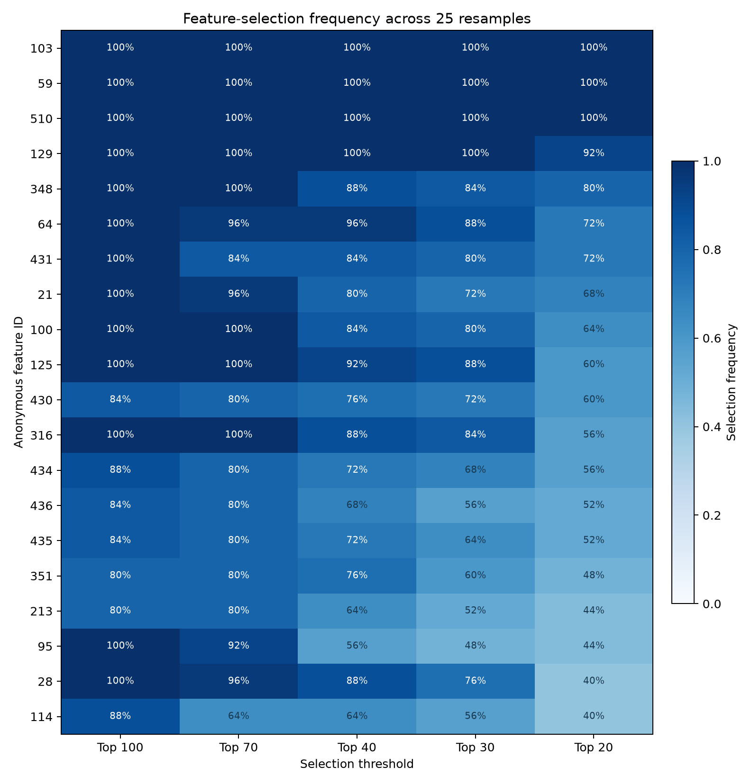
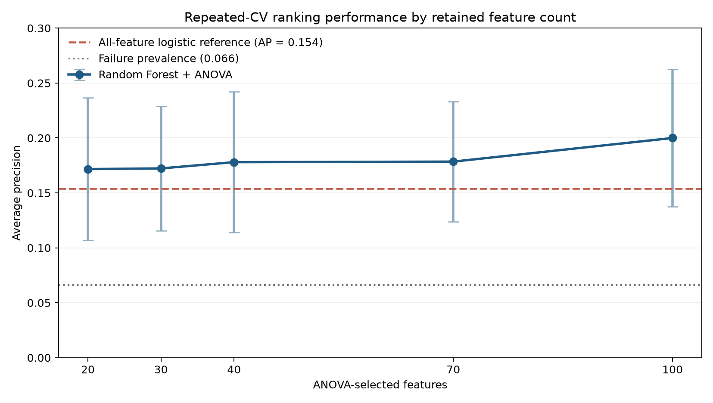

# SECOM Semiconductor Feature Screening

## A reproducible investigation of high-dimensional manufacturing signals

**Dashel Ruiz Perez** 
**ML Data Engineer/Analyst** 
**Link in page:** [https://www.linkedin.com/in/dashel-ruiz-perez/](https://www.linkedin.com/in/dashel-ruiz-perez/) 
**Project repository:** [github.com/DRPproton/semiconductor-projects-tda/tree/main/Project-1_SECOM](https://github.com/DRPproton/semiconductor-projects-tda/tree/main/Project-1_SECOM)   
**Project website:**[Add deployed project URL] 
**Prepared:** August 2026

> **Editing note:** This study uses only the public UCI SECOM dataset and contains no confidential manufacturing data.

## Abstract

Modern semiconductor processes can generate hundreds of measurements for each manufactured unit, but only a fraction may be useful for investigating yield excursions. The public SECOM dataset illustrates this problem: it contains 1,567 observations, 590 anonymous numeric process measurements, extensive missing data, and only 104 recorded failures. This study aimed to reduce that high-dimensional space to a reproducible set of variables for engineering investigation while avoiding claims the available data could not support.

The analysis combined data-quality screening, exploratory statistics, correlation analysis, principal component analysis, multiple feature-selection methods, imbalanced classification, hyperparameter optimization, and repeated cross-validation. After removing constant, selected near-constant, and greater-than-80%-missing variables, 460 candidate features remained. We then repeated feature selection across 25 stratified resamples, relearning filtering, median imputation, and ANOVA selection within each training fold.

Five anonymous variables formed the strongest investigation tier. Features 103, 59, and 510 appeared in every top-20 selection; features 129 and 348 appeared in 92% and 80% of the top-20 selections, respectively. A tuned Random Forest using 100 ANOVA-selected features achieved the strongest tested Random Forest ranking result, with repeated-cross-validation average precision of 0.2000 ± 0.0627 against a failure prevalence of 0.0662. However, its default-threshold failure recall was only 0.0196. The project therefore produced a defensible feature-screening hierarchy, not a production-ready failure detector or a root-cause diagnosis. The correct next step is to map the shortlisted feature IDs to real sensors, tools, process stages, and operating conditions, then validate the frozen analysis on independent temporal data.

**Keywords:** semiconductor manufacturing, feature selection, imbalanced classification, process monitoring, Random Forest, stability analysis, SECOM

## 1. The engineering question

Manufacturing engineers frequently collect more signals than they can investigate efficiently. Some measurements contain relevant process information; others are redundant, rarely observed, or dominated by noise. A machine-learning workflow can help prioritize measurements, but only if you interpret its output at the level supported by the data.

This project asked:

> Which SECOM process variables remain relevant when the training sample changes, and which should be investigated first by an engineer with access to the missing process context?

The primary objective was feature relevance and support for investigation. Prediction was a supporting objective used to test whether the selected representations retained failure information. This distinction matters. A variable can be useful for ranking or investigation without establishing a causal mechanism, and a model can rank failures better than chance while still being unsuitable for operational alerts.

The final output was designed as three complementary products:

1. a **100-feature predictive representation** that retained the strongest tested Random Forest ranking performance;
2. a **20-feature engineering shortlist** that favored interpretability and repeated selection; and
3. a **five-feature core** for the first process-engineering review.

These products answer different questions and should not be treated as interchangeable.

## 2. Data and analytical scope

The study used the public SECOM dataset contributed by McCann and Johnston to the UCI Machine Learning Repository [1]. The merged local dataset contained 1,567 observations, 590 anonymous numeric process features, one timestamp, and a binary label. A label of `-1` represented pass and `1` represented fail.

Only 104 observations were failures, corresponding to 6.64% of the data. The stratified development split preserved this imbalance:

| Partition | Observations | Failures | Failure rate |
|---:|---:|---:|---:|
| Training | 1,253 | 83 | 6.62% |
| Test | 314 | 21 | 6.69% |

Ordinary accuracy was not an appropriate primary metric because an always-pass classifier would already be approximately 93.4% accurate. The main ranking metric was **average precision**, which evaluates the complete precision-recall ranking and is informative for rare positive outcomes. Threshold-dependent measures included failure recall, false-negative rate, failure precision, F1 score, and balanced accuracy.

The analysis was intentionally bounded. Because the feature names are anonymous, the results cannot identify a physical sensor, process step, chamber, recipe, or controllable mechanism. They can only prioritize feature IDs for later translation by subject-matter experts.

## 3. Methodology

### 3.1 Data-quality screening

The first stage removed variables that did not contain enough information for stable analysis:

| Screening decision | Variables removed | Rationale |
|---|---:|---|
| Constant features | 116 | No observed variation and therefore no discriminatory information. |
| Selected near-constant features | 6 | Three observed states, including missingness, with zero dominating the observed values. |
| Features with more than 80% missing values | 8 | Too little observed support for stable estimation in a small, imbalanced sample. |
| **Remaining modeling space** | **460** | Numeric variables retained for subsequent analysis. |

Median imputation was used for models that could not accept missing values. In validation, we learned imputation values only from the corresponding training fold.

### 3.2 Exploratory analysis

The retained dataset remained statistically difficult. The exploratory review identified 259 highly skewed features, 28 outlier-heavy features, 37 variables with notable pass/fail distribution shifts, and 224 strong correlation pairs involving 263 variables. Features 59, 103, 510, and 348 showed some of the strongest standardized pass/fail shifts. Features 64 and 65 also showed an elevated observed failure rate in their extreme regions.

These are associative findings. Correlated measurements could be duplicate sensors, sequential process responses, or different measurements reacting to the same latent condition. Without equipment metadata, the statistical analysis cannot decide among those explanations.

### 3.3 Dimensionality assessment

Principal component analysis tested whether a small number of latent dimensions could summarize the process measurements. It required 87 components to retain 80% of the variance, 129 components for 90%, and 164 components for 95%. The first two components explained only 9.34% of total variance and did not visibly separate passes from failures.

PCA therefore supported two conclusions. First, redundancy exists, but the dataset does not collapse into a simple low-dimensional failure boundary. Second, using principal components as the final representation would make engineering interpretation harder because each component combines many anonymous measurements. We retained PCA as an exploratory result rather than using it in the final feature-identification pipeline.

### 3.4 Feature-selection strategy

Several methods were compared because each defines relevance differently:

- ANOVA F scores measured one-variable-at-a-time class separation.
- Mutual information measured more general univariate dependence.
- Random Forest impurity importance reflected nonlinear and multivariable tree splits.
- Recursive feature elimination ranked variables through repeated estimator fitting.
- Correlation pruning reduced redundancy but could remove one member of a physically meaningful signal group.

The methods did not return identical rankings. This disagreement was expected and useful: it showed that a single fitted importance list would be too fragile to serve as the final engineering handoff.

The final shortlist therefore emphasized **selection stability**. Stratified five-fold cross-validation was repeated five times, producing 25 resamples. Within every resample, the greater-than-80%-missingness filter, median imputation, and `SelectKBest(f_classif)` ranking were learned from the training portion only. Selection frequencies were recorded for top-100, top-70, top-40, top-30, and top-20 thresholds.

### 3.5 Model comparison and tuning

We explored Balanced Logistic Regression, Random Forest, and HistGradientBoosting representations. Optuna compared model and feature-count choices using five-fold average precision. The strongest fixed-split trial was a 100-feature Random Forest with average precision of 0.23085. Because this was the best of 50 trials evaluated on one cross-validation partition, we treated that result as selection-optimistic.

The selected Random Forest configuration was reassessed using five-fold cross-validation repeated five times. We used this repeated estimate—rather than the best optimization trial—as the final performance summary. Preprocessing and selection remained inside the pipeline so each validation fold learned from its own training data.

## 4. Results

### 4.1 A reproducible five-feature core emerged

**Figure 1. Feature-selection frequency across 25 repeated validation resamples.** Each cell reports how often an anonymous variable was retained at a specified selection threshold. The repeated folds overlap, so these values measure resampling stability rather than independent probabilities or causal confidence.

Three variables—103, 59, and 510—were present in every top-20 list. Feature 129 appeared in 92% of top-20 selections, and feature 348 appeared in 80%. Their agreement across different training samples created a stronger case for investigation than a single full-data ranking.

| Feature ID | Top-20 selection frequency | Full-training ANOVA rank | Random Forest importance rank |
|---:|---:|---:|---:|
| 103 | 100% | 1 | 1 |
| 59 | 100% | 3 | 2 |
| 510 | 100% | 2 | 8 |
| 129 | 92% | 5 | 25 |
| 348 | 80% | 4 | 50 |

Features 64, 431, 21, 100, 125, and 430 formed a supporting tier, with top-20 frequencies between 60% and 72%. The project’s technical report [2] includes the complete 20-feature list. Feature 114 was retained only as an exploratory rare-state candidate: it appeared in 40% of top-20 selections. However, it had zero importance in the fitted top-100 Random Forest and did not belong to the cross-method core.

### 4.2 The broader representation ranked failures better

**Figure 2. ** Repeated-cross-validation ranking performance by retained feature count.** Points show mean average precision for tuned Random Forest models; error bars show plus or minus one standard deviation. Failure prevalence and the all-feature Logistic Regression result are references. The Logistic Regression is a different classifier and is not a controlled feature-count comparison.

The 100-feature Random Forest produced the highest numerical average precision among the controlled Random Forest experiments. Its mean average precision of 0.2000 was approximately three times the 0.0662 failure prevalence, indicating that its probability ranking contained useful information. The differences among feature counts were nevertheless small relative to fold-to-fold variability, so the result supports a numerical preference rather than proof of strict superiority.

| Representation | Classifier | Average precision | Failure recall | False-negative rate |
|---|---|---:|---:|---:|
| All 460 features | Balanced Logistic Regression | 0.1539 ± 0.0536 | 0.2650 ± 0.1167 | 0.7350 |
| Top 100 ANOVA features | Tuned Random Forest | **0.2000 ± 0.0627** | 0.0196 ± 0.0414 | 0.9804 |
| Top 20 ANOVA features | Tuned Random Forest | 0.1717 ± 0.0648 | 0.0887 ± 0.0720 | 0.9113 |

The all-feature Logistic Regression detected more failures at the default threshold but had lower ranking performance. Because the classifier family and feature count both changed, treat its result as a reference rather than evidence that 460 features are better or worse than 100.

### 4.3 Ranking signal did not create a usable alert system

The leading Random Forest detected only about 2% of failures at the standard 0.50 threshold and missed approximately 98%. This is not a contradiction with its average precision result. Average precision evaluates how predicted scores rank failures across all thresholds; recall evaluates decisions at one threshold. A model can improve the ranking while assigning nearly every case a probability below 0.50.

No operating threshold was selected because the project did not define costs for missed failures, false alarms, or engineering review capacity. Without that decision, a final confusion matrix would imply an arbitrary operating policy. The Random Forest should therefore be described as a feature-ranking aid, not a deployed failure classifier.

## 5. Engineering interpretation

The project achieved its realistic objective: it reduced hundreds of anonymous process measurements to a reproducible investigation hierarchy. The evidence supports three practical conclusions.

First, **features 103, 59, and 510 are the strongest starting points** because they combined high univariate ranks with perfect top-20 stability across 25 resamples. Features 129 and 348 extend that core when you can investigate five measurements.

Second, **failure information appears to be distributed across a broader group of variables**. The 100-feature model retained the strongest tested Random Forest ranking performance, while smaller representations traded predictive information for interpretability. The 100-feature set is useful for modeling work; the 20-feature and five-feature sets are better suited to an engineering review.

Third, **statistical relevance is not physical explanation**. Anonymous feature IDs cannot identify an assignable cause. Each shortlisted variable should be converted into an engineering question: What was measured? At which process step? On which tool and chamber? Under which recipe? Was the measurement available before the recorded outcome? Does its missingness indicate equipment behavior or an optional process path?

## 6. Limitations and uncertainty

This study has several important limitations:

1. **Anonymous variables.** Sensor names, units, process stages, tools, chambers, recipes, control limits, and maintenance records are unavailable. Mechanistic interpretation is therefore impossible.
2. **Rare outcome and small failure sample.** Only 104 failures exist in the full dataset, including 83 in the training partition. Consequently, metrics and feature effects have substantial uncertainty.
3. **Observational association.** A feature’s relationship with failure does not prove that changing it would improve yield.
4. **Dependent resamples.** Repeated cross-validation folds overlap. Stability frequencies and metric distributions are not independent replications.
5. **Model-selection optimism.** Optuna selected the best of 50 trials on one fixed fold partition. Repeated validation provided a more cautious estimate, but the same development data still informed modeling decisions.
6. **Correlated importance.** Random Forest impurity importance can favor particular variables and divide credit unpredictably among correlated features.
7. **Test-set status** The test partition was viewed once during an earlier preliminary baseline evaluation. It was not used in the later feature selection, tuning, or stability analysis, but it is no longer a perfectly untouched final holdout.
8. **No operating threshold.** No alert threshold or manufacturing cost function was defined; production recall, alert volume, and false-alarm tradeoffs remain unevaluated.

These limitations do not invalidate the shortlist. They define what the shortlist means: a reproducible prioritization under the available public data, not an estimate of causal importance or production performance.

## 7. Recommended engineering handoff

Begin the next phase only when process metadata or a comparable real manufacturing dataset is available.

1. **Map the core five IDs to physical metadata.** Record sensor name, unit, process step, tool, chamber, recipe, sampling time, and control limits for features 103, 59, 510, 129, and 348.
2. **Verify temporal availability.** Confirm that each measurement occurs before the failure outcome and would be available when an operational decision must be made.
3. **Stratify by manufacturing context.** Compare the shortlisted variables by tool, chamber, recipe, product, lot, wafer position, maintenance state, and time period.
4. **Investigate redundancy as process structure.** Determine whether correlated shortlisted features represent duplicate sensing, consecutive process stages, or a shared process condition.
5. **Interpret missingness operationally.** Test whether missing values are associated with sensor faults, optional recipe steps, tool configurations, or data-collection behavior.
6. **Freeze and validate.** Lock the preprocessing, selection, and model configuration before applying it to a later production period or independent manufacturing cohort.
7. **Define an alert policy only if classification remains a goal.** Choose a required failure-recall target or explicit cost function using out-of-fold probabilities, then evaluate the resulting false-alarm rate and review workload on independent data. 

## 8. Conclusion

This case study demonstrates a disciplined way to work with a wide, noisy, imbalanced manufacturing dataset. Rather than optimizing ordinary accuracy or presenting one fitted importance ranking as fact, the workflow combined fold-local preprocessing, multiple definitions of relevance, rare-event metrics, repeated validation, and selection stability.

The final result is a tiered and actionable research handoff. Features 103, 59, and 510 were the most reproducible candidates; features 129 and 348 completed the core five. A 100-feature Random Forest retained the strongest tested Random Forest ranking signal, while the 20-feature list provided a more interpretable investigation boundary. None of these results establishes root cause, and the default-threshold models are not suitable for production failure detection.

The project's value is therefore not a claim that the SECOM problem has been solved. It is the conversion of an unmanageable 590-measurement search space into a transparent set of priorities, uncertainties, and next questions for engineers with the physical context needed to continue the investigation.

## Reproducibility and project materials

- **Project repository:** [SECOM project folder](https://github.com/DRPproton/semiconductor-projects-tda/tree/main/Project-1_SECOM)
- **Analysis notebook:** [notebooks/notebook.ipynb](https://github.com/DRPproton/semiconductor-projects-tda/blob/main/Project-1_SECOM/notebooks/notebook.ipynb)
- **Complete technical report:** [documents/Final_Report.md](https://github.com/DRPproton/semiconductor-projects-tda/blob/main/Project-1_SECOM/documents/Final_Report.md)
- **Detailed model evaluation log:** [documents/models_eval.md](https://github.com/DRPproton/semiconductor-projects-tda/blob/main/Project-1_SECOM/documents/models_eval.md)
- **Project website:** [Add deployed project URL]

## References

[1] M. McCann and A. Johnston, “SECOM,” *UCI Machine Learning Repository*, 2008. doi: [10.24432/C54305](https://doi.org/10.24432/C54305).

[2] Dashel Ruiz Perez, “SECOM Semiconductor Feature-Screening Final Report,” *Semiconductor Projects—TDA*, 2026. [View the complete report](https://github.com/DRPproton/semiconductor-projects-tda/blob/main/Project-1_SECOM/documents/Final_Report.md).
